# System Architecture

Simple overview of the Xandeum pNodes Analytics Platform architecture.

```mermaid
graph LR
    subgraph FE["FRONTEND<br/>(Next.js 16 + React 19)"]
        FE1["/<br/>Dashboard"]
        FE2["/pods<br/>Pods List"]
        FE3["/pods/{id}<br/>Pod Details"]
        FE4["/network/map<br/>Network Map"]
    end

    subgraph BE["BACKEND<br/>(Next.js API Routes)"]
        direction TB
        API1["GET /api/v1/network"]
        API2["GET /api/v1/network/history"]
        API3["GET /api/v1/pnodes"]
        API4["GET /api/v1/pnodes/{id}"]
        API5["GET /api/v1/pnodes/{id}/history"]
    end

    subgraph Cache["REDIS<br/>(Upstash)"]
        Redis["Cache Layer<br/>TTL: 30-300s"]
    end

    subgraph DB["SUPABASE DB<br/>(PostgreSQL)"]
        direction TB
        T1["pnodes"]
        T2["pnode_stats"]
        T3["network"]
        T4["network_stats"]
    end

    subgraph Cron["CRON JOBS<br/>(pg_cron)"]
        direction TB
        Cron1["Every 1 min<br/>Basic stats"]
        Cron2["Every 1 hour<br/>Detailed stats"]
    end

    subgraph EdgeFuncs["SUPABASE<br/>EDGE FUNCTIONS"]
        direction TB
        Edge1["collect-pnode-stats"]
        Edge2["collect-detailed-stats"]
    end

    subgraph RPC["XANDEUM<br/>RPC NETWORK"]
        direction TB
        RPCN["• get-pods<br/>• get-stats<br/>• get-pods-with-stats"]
    end

    FE -->|HTTP/REST| BE
    BE -->|Query| Redis
    Redis -.->|Miss| DB
    BE -->|Query| DB
    BE -.->|Live<br/>?refresh=true| RPCN
    
    Cron -->|Invoke| EdgeFuncs
    EdgeFuncs -->|RPC Call| RPCN
    EdgeFuncs -->|INSERT/UPDATE| DB

    style FE fill:#e1f5ff
    style BE fill:#fff4e1
    style Cache fill:#ffe1e1
    style DB fill:#e1ffe1
    style Cron fill:#f0e1ff
    style EdgeFuncs fill:#ffe1f0
    style RPC fill:#e1e1ff
```



## Data Flow

### 1. Automated Background Updates

**Every 1 Minute:**
```
pg_cron → collect-pnode-stats → RPC (get-pods) → Supabase DB
```
- Updates node list
- Refreshes uptime & last seen
- Recalculates health scores

**Every 1 Hour:**
```
pg_cron → collect-detailed-stats → RPC (get-pods-with-stats) → Supabase DB
```
- Fetches detailed metrics (CPU, RAM, packets)
- Creates historical snapshots
- Updates network aggregates

### 2. Real-time User Requests

**Cached Queries:**
```
Frontend → Backend API → Redis (if cached) → Response
                      ↓
                 Supabase DB (if not cached) → Redis → Response
```

**Live Mode Queries:**
```
Frontend → Backend API → RPC (direct) → Response
```
- Bypasses database for real-time data
- Used with `?refresh=true` parameter
- No caching applied

## Component Responsibilities

### Frontend (FE)
- React components with shadcn/ui
- Real-time charts with Recharts
- Interactive maps with Leaflet
- Client-side filtering & search
- Automatic 30s dashboard refresh

### Backend (BE)
- REST API endpoints (Next.js App Router)
- Request validation & sanitization
- Database queries via Prisma ORM
- Redis cache management
- Response formatting & pagination
- Direct RPC integration for live data

### Supabase Database
- Persistent storage for all nodes & metrics
- Historical data for trend analysis
- Geo-enrichment (latitude, longitude, city, country)
- Prisma schema with indexed queries
- Connection pooling enabled

### Redis Cache
- In-memory caching layer (Upstash)
- TTL-based expiration (30-300s)
- Reduces database load
- Improves API response times
- Cache keys per endpoint

### Edge Functions
- Deno runtime (TypeScript)
- Triggered by pg_cron schedulers
- RPC client for Xandeum network
- Batch data processing
- Error handling & retries

### Cron Jobs
- PostgreSQL pg_cron extension
- 1-minute job: Basic stats collection
- 1-hour job: Detailed stats & history
- Runs inside Supabase database
- Invokes edge functions via HTTP

### RPC Network
- Xandeum blockchain RPC server
- Methods: `get-pods`, `get-stats`, `get-pods-with-stats`
- Returns real-time node data
- Public endpoint (no auth required)
- Response time: 500ms - 2s

---

[← Back to README](./README.md)
