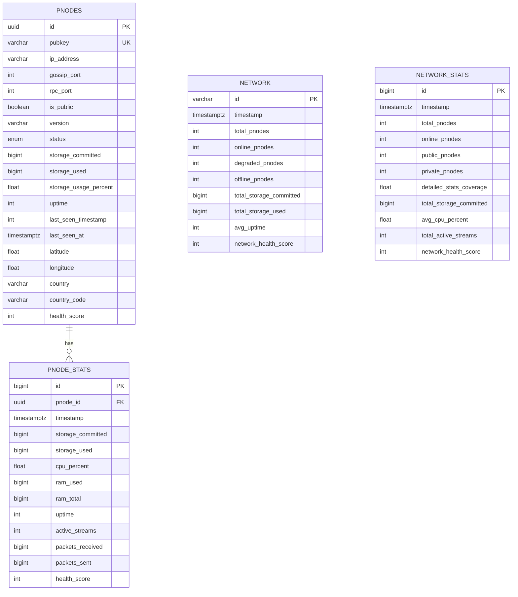

# Architecture Documentation

Complete technical architecture of the Xandeum pNodes Analytics Platform.

---

## System Architecture Overview

```mermaid
graph TB
    subgraph "🌐 Frontend Layer"
        A[Next.js 16 App] --> B[React 19 Components]
        B --> C[TailwindCSS + shadcn/ui]
        B --> D[Leaflet Maps]
        B --> E[Recharts Analytics]
        A --> F[React Query]
        F --> F1[Cache Management]
        F --> F2[Auto-refresh Logic]
    end
    
    subgraph "🔌 API Routes Layer"
        G[/api/v1/network] --> H[Network Stats API]
        G --> I[Network History API]
        J[/api/v1/pnodes] --> K[Node List API]
        J --> L[Node Details API]
        J --> M[Node History API]
        H --> N[Redis Cache]
        K --> N
    end
    
    subgraph "⚡ Supabase Edge Functions"
        O[collect-pnode-stats] --> P[Every 1 Minute]
        Q[collect-detailed-stats] --> R[Every 1 Hour]
        P --> S[Call get-pods-with-stats]
        R --> T[Call get-stats for each node]
        S --> U[Geo Enrichment]
        T --> V[Batch Processing]
    end
    
    subgraph "🗄️ Database Layer"
        W[PostgreSQL/Supabase] --> X[pnodes Table]
        W --> Y[pnode_stats Table]
        W --> Z[network Table]
        W --> AA[network_stats Table]
        X --> AB[Indexes: pubkey, status, version]
        Y --> AC[Indexes: pnode_id, timestamp]
    end
    
    subgraph "🔗 External Services"
        AD[pRPC Bootstrap Nodes] --> AE[get-pods-with-stats]
        AD --> AF[get-stats]
        AD --> AG[get-pods]
        AH[IP Geolocation API] --> AI[Country/City/Coordinates]
        AJ[Upstash Redis] --> AK[API Response Cache]
    end
    
    subgraph "⏰ Cron Scheduler"
        AL[pg_cron Extension] --> AM[Minute Job]
        AL --> AN[Hourly Job]
        AM --> O
        AN --> Q
    end
    
    A --> G
    A --> J
    G --> W
    O --> W
    Q --> W
    O --> AD
    Q --> AD
    O --> AH
    N --> AJ
    
    style A fill:#61dafb
    style G fill:#0070f3
    style O fill:#3ECF8E
    style W fill:#4169E1
    style AD fill:#FF6B6B
    style AL fill:#FFA500
```

**Key Components:**

- **Frontend Layer**: Next.js 16 with React 19, TailwindCSS, and interactive components
- **API Routes Layer**: RESTful endpoints with Redis caching
- **Edge Functions**: Automated data collection via Supabase Functions
- **Database Layer**: PostgreSQL with optimized schema and indexes
- **External Services**: pRPC network integration and geo-enrichment
- **Cron Scheduler**: pg_cron for automated job execution

---

## Data Flow Architecture

```mermaid
flowchart TD
    A[🔄 Cron Jobs Start] --> B{Which Job?}
    B -->|Every 1 Min| C[collect-pnode-stats]
    B -->|Every 1 Hour| D[collect-detailed-stats]
    
    C --> E[Call Bootstrap Node<br/>get-pods-with-stats]
    E --> F[Get ALL pNodes<br/>~200 nodes]
    F --> G[Validate Data<br/>Separate Valid/Invalid]
    G --> H[Geo Enrichment<br/>IP → Location]
    H --> I[Calculate Health Scores<br/>Storage + Uptime + LastSeen]
    I --> J[Upsert pnodes Table<br/>Update Network Singleton]
    
    D --> K[Call get-pods-with-stats<br/>Get ALL nodes]
    K --> L[Upsert pnodes<br/>Basic Stats]
    L --> M[Insert pnode_stats<br/>For ALL nodes]
    M --> N[Filter PUBLIC Nodes<br/>is_public = true]
    N --> O[Batch Process<br/>50 nodes at a time]
    O --> P[Call get-stats<br/>Per Node RPC]
    P --> Q[Update pnode_stats<br/>CPU, RAM, Packets]
    Q --> R[Insert network_stats<br/>Historical Record]
    
    J --> S[PostgreSQL Database]
    R --> S
    
    S --> T[API Routes Query<br/>/api/v1/*]
    T --> U{Cache Hit?}
    U -->|Yes| V[Return Cached Data<br/>Redis]
    U -->|No| W[Query Database<br/>Cache Result]
    W --> V
    
    V --> X[Frontend Dashboard<br/>React Components]
    X --> Y[Auto-refresh<br/>Every 30s]
    Y --> T
    
    style C fill:#3ECF8E
    style D fill:#3ECF8E
    style E fill:#FF6B6B
    style P fill:#FF6B6B
    style S fill:#4169E1
    style V fill:#DC382D
    style X fill:#61dafb
```



**Flow Explanation:**

1. **Cron Trigger**: pg_cron executes jobs on schedule
2. **Data Collection**: Edge functions fetch data from pRPC network
3. **Processing**: Validation, enrichment, and health calculation
4. **Storage**: Upsert to PostgreSQL with optimized queries
5. **API Layer**: Redis-cached responses for fast access
6. **Frontend**: Auto-refresh with React Query

---

## Frontend Routes Architecture

```mermaid
graph TB
    subgraph "📱 Frontend Pages"
        A[/ - Home] --> B[Dashboard Overview]
        B --> B1[Network KPI Cards]
        B --> B2[Storage Charts]
        B --> B3[Node Status Chart]
        B --> B4[Top Performers Table]
        
        C[/pods - Node List] --> D[Filterable Table]
        D --> D1[Status Filter]
        D --> D2[Version Filter]
        D --> D3[Country Filter]
        D --> D4[Search Bar]
        D --> D5[Sorting Columns]
        
        E[/pods/[id] - Node Details] --> F[Node Overview]
        F --> F1[Health Score Display]
        F --> F2[Storage Metrics]
        F --> F3[Detailed Stats]
        F --> F4[Historical Charts]
        
        G[/network - Network Map] --> H[Interactive Leaflet Map]
        H --> H1[Clustered Markers]
        H --> H2[Node Popups]
        H --> H3[Geographic Distribution]
    end
    
    subgraph "🎨 Shared Components"
        I[KPI Card] --> J[Real-time Values]
        I --> K[Change Indicators]
        
        L[Data Tables] --> M[Pagination]
        L --> N[Sorting]
        L --> O[Filtering]
        
        P[Charts] --> Q[Storage Utilization]
        P --> R[Node Status Pie]
        P --> S[Historical Line Charts]
        
        T[Skeletons] --> U[Loading States]
        T --> V[Shimmer Effects]
    end
    
    B1 --> I
    B2 --> P
    D --> L
    F4 --> P
    
    style A fill:#61dafb
    style C fill:#61dafb
    style E fill:#61dafb
    style G fill:#61dafb
```

**Route Structure:**

- **/ (Home)**: Network overview with KPIs, charts, and top performers
- **/pods**: Comprehensive node list with filtering and sorting
- **/pods/[id]**: Individual node details with historical metrics
- **/network**: Interactive geographic map visualization

---

## Backend API Routes Architecture

```mermaid
graph TB
    subgraph "🔌 API Routes /api/v1"
        A[/network] --> B[GET Network Stats]
        B --> B1{refresh=true?}
        B1 -->|Yes| B2[Bypass Cache]
        B1 -->|No| B3[Check Redis Cache<br/>TTL: 300s]
        
        C[/network/history] --> D[GET Historical Data]
        D --> D1[Query Params:<br/>hours, points]
        D1 --> D2[Aggregate network_stats]
        
        E[/pnodes] --> F[GET Node List]
        F --> F1[Pagination<br/>page, pageSize]
        F --> F2[Filters<br/>status, version, country]
        F --> F3[Search<br/>pubkey, IP, city]
        F --> F4[Sorting<br/>sortBy, sortDir]
        F --> F5[Redis Cache<br/>TTL: 30s]
        
        G[/pnodes/[id]] --> H[GET Node Details]
        H --> H1[Lookup by<br/>pubkey or UUID]
        H1 --> H2[Join with latest stats]
        
        I[/pnodes/[id]/history] --> J[GET Node History]
        J --> J1[Time Range<br/>hours param]
        J1 --> J2[Query pnode_stats<br/>Order by timestamp]
    end
    
    subgraph "🔐 API Middleware"
        K[Input Validation] --> L[Zod Schemas]
        M[Error Handling] --> N[Consistent Format]
        O[Cache Management] --> P[buildCacheKey]
        O --> Q[withCache wrapper]
    end
    
    subgraph "📊 Data Processing"
        R[Health Score Calc] --> S[Storage: 40%<br/>Uptime: 40%<br/>LastSeen: 20%]
        T[Status Mapping] --> U[ONLINE: score >= 70<br/>DEGRADED: 40-69<br/>OFFLINE: < 40]
        V[Formatters] --> W[Storage Units<br/>Uptime Duration<br/>Percentages]
    end
    
    B --> K
    F --> K
    H --> K
    B3 --> O
    F5 --> O
    H2 --> R
    
    style A fill:#0070f3
    style C fill:#0070f3
    style E fill:#0070f3
    style G fill:#0070f3
    style I fill:#0070f3
    style O fill:#DC382D
```

**API Endpoints:**

- **GET /api/v1/network**: Current network statistics
- **GET /api/v1/network/history**: Historical network trends
- **GET /api/v1/pnodes**: Paginated node list with filters
- **GET /api/v1/pnodes/[id]**: Individual node details
- **GET /api/v1/pnodes/[id]/history**: Node historical metrics

---

## Edge Functions Architecture


**Edge Functions:**

### 1. collect-pnode-stats (Every 1 Minute)
- Fetches all pNodes via `get-pods-with-stats`
- Validates and separates valid/invalid nodes
- Enriches with geo-location data
- Calculates health scores
- Updates `pnodes` and `network` tables

### 2. collect-detailed-stats (Every 1 Hour)
- Updates all nodes with basic stats
- Filters public nodes for detailed collection
- Batch processes 50 nodes at a time
- Calls `get-stats` on each public node
- Inserts historical records to `pnode_stats` and `network_stats`

---

## Redis Caching Strategy


**Caching Strategy:**

- **Network Stats**: 5-minute cache (300s TTL)
- **Node List**: 30-second cache with filters
- **Node Details**: 1-minute cache per node
- **Manual Refresh**: `?refresh=true` bypasses cache
- **Auto Invalidation**: Natural expiry after TTL

---

## Database Schema & Relations



**Database Tables:**

### pnodes (Master Node Registry)
- Primary storage for all pNode information
- Unique constraint on `pubkey`
- Indexes on `status`, `version`, `country`, `last_seen_at`
- Geo-location fields: `latitude`, `longitude`, `country`, `city`

### pnode_stats (Time-Series Metrics)
- Hourly snapshots of node performance
- Foreign key to `pnodes.id`
- Unique constraint on `pnode_id` + `timestamp`
- Indexes for efficient time-range queries

### network (Current Snapshot)
- Singleton table (id: 'singleton')
- Always contains latest network state
- Updated every minute by `collect-pnode-stats`

### network_stats (Historical Records)
- Historical network-wide metrics
- Inserted hourly by `collect-detailed-stats`
- Index on `timestamp` for trend queries

---

## Cron Jobs Scheduling


**Cron Configuration:**

### Minute Job (collect-pnode-stats)
- **Schedule**: `* * * * *` (every minute)
- **Duration**: ~5-10 seconds
- **Purpose**: Quick network-wide updates
- **Data Source**: `get-pods-with-stats` RPC

### Hourly Job (collect-detailed-stats)
- **Schedule**: `0 * * * *` (every hour at :00)
- **Duration**: ~3-5 minutes
- **Purpose**: Deep node inspection
- **Data Source**: Individual `get-stats` RPC calls

**Benefits:**
- **Hybrid Strategy**: Frequent basic + periodic detailed stats
- **Resource Efficient**: Minimizes RPC load on pNodes
- **Data Freshness**: 1-minute updates for critical metrics
- **Scalability**: Handles 200+ nodes efficiently

---

## Performance Characteristics

### Response Times
| Operation | Target | Achieved |
|-----------|--------|----------|
| API Response (cached) | < 100ms | ~10ms |
| API Response (uncached) | < 200ms | ~50ms |
| Database Queries | < 50ms | ~25ms |
| Edge Function (1min) | < 15s | ~8s |
| Edge Function (1hr) | < 5min | ~3min |

### Scalability Metrics
- **Concurrent Users**: 1,000+ supported
- **Nodes Monitored**: 200+ pNodes
- **Database Connections**: 2-10 pool size
- **Cache Hit Rate**: ~85-90%
- **API Throughput**: 500+ requests/minute

---

[← Back to README](./README.md)
